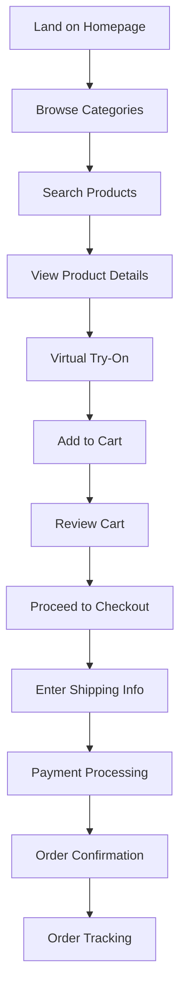
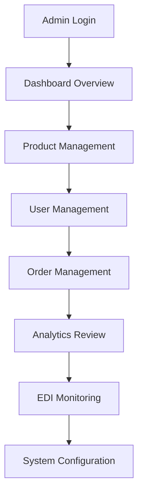
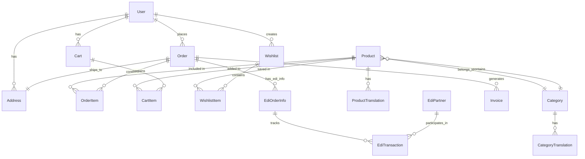
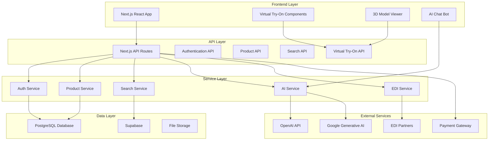

# UMetha E-Commerce Platform Documentation

## Cover Page

**Project Name:** UMetha - Premium Fashion & Lifestyle E-Commerce Platform

**Group Information:**
- **Group Name:** [To be filled by development team]
- **Team Members:** [To be filled by development team]
- **Project Duration:** [To be filled by development team]

**Project Links:**
- **GitHub Repository:** [To be provided by development team]
- **Scrum Agile Board:** [To be provided by development team]
- **Live Application:** [To be provided by development team]
- **Code Quality & Security:**
  - SonarQube: [To be provided by development team]
  - Snyk: [To be provided by development team]

---

## Introduction to Project

### High-Level Problem Background

The fashion and lifestyle e-commerce industry faces significant challenges in providing personalized, immersive shopping experiences that bridge the gap between online and physical retail. Traditional e-commerce platforms lack the ability to help customers visualize how products will look on them or fit in their spaces, leading to high return rates, customer dissatisfaction, and lost sales.

### Client and Problem Statement

**Target Client:** Fashion-conscious consumers, lifestyle enthusiasts, and tech-savvy shoppers seeking premium, personalized shopping experiences.

**Core Problems Solved:**
1. **Virtual Try-On Gap:** Customers cannot visualize how clothing items will look on them before purchasing
2. **Room Visualization:** Furniture and home decor items lack spatial context for customers
3. **Personalization:** Limited AI-driven recommendations and search capabilities
4. **Multilingual Support:** Global reach is limited by language barriers
5. **Influencer Integration:** Lack of seamless integration between social media influence and e-commerce
6. **EDI Integration:** Complex supply chain management and automated order processing

### Solution Overview

UMetha is a next-generation e-commerce platform that combines cutting-edge technologies including:
- **Virtual Try-On Technology** using AI and 3D modeling
- **Room Visualization** for furniture and home decor
- **AI-Powered Search** with image recognition capabilities
- **Multilingual Support** across 25+ languages
- **Influencer Marketplace** integration
- **EDI (Electronic Data Interchange)** for automated supply chain management
- **Real-time Analytics** and performance monitoring

---

## Team Work Agreement

### Team Rules and Guidelines

**Communication:**
- Daily standup meetings at 9:00 AM
- Slack for real-time communication
- Weekly sprint planning and retrospective meetings
- Code review requirements for all pull requests

**Attendance:**
- Mandatory attendance for all sprint ceremonies
- 24-hour notice required for planned absences
- Make-up sessions for missed critical meetings

**Development Standards:**
- Follow GitFlow branching strategy
- Write comprehensive unit tests for all new features
- Maintain 80%+ code coverage
- Use TypeScript for all new code
- Follow ESLint and Prettier configurations

### Definition of Ready (DoR)

A user story is considered ready when:
- [ ] Acceptance criteria are clearly defined
- [ ] UI/UX mockups are approved
- [ ] Technical requirements are documented
- [ ] Dependencies are identified and resolved
- [ ] Story is estimated and assigned to a sprint
- [ ] Test cases are outlined

### Definition of Done (DoD)

A user story is considered done when:
- [ ] All acceptance criteria are met
- [ ] Code is written and reviewed
- [ ] Unit tests pass with 80%+ coverage
- [ ] Integration tests pass
- [ ] UI/UX matches approved designs
- [ ] Performance requirements are met
- [ ] Security scan passes
- [ ] Documentation is updated
- [ ] Feature is deployed to staging
- [ ] Product owner acceptance is obtained

---

## Roadmap (High-Level Plan)

### Sprint Overview

**Sprint 1 (Weeks 1-2): Foundation & Core Setup**
- **Lead:** [To be assigned]
- **Focus:** Project setup, authentication, basic UI framework
- **Deliverables:** User authentication, basic product catalog, shopping cart

**Sprint 2 (Weeks 3-4): Product Management & Search**
- **Lead:** [To be assigned]
- **Focus:** Product CRUD operations, search functionality
- **Deliverables:** Product management system, advanced search, filtering

**Sprint 3 (Weeks 5-6): Virtual Try-On Integration**
- **Lead:** [To be assigned]
- **Focus:** AI-powered virtual try-on features
- **Deliverables:** Virtual fitting room, 3D model viewer, outfit recommendations

**Sprint 4 (Weeks 7-8): Multilingual & Internationalization**
- **Lead:** [To be assigned]
- **Focus:** i18n implementation, language switching
- **Deliverables:** Multi-language support, localized content

**Sprint 5 (Weeks 9-10): Influencer Integration**
- **Lead:** [To be assigned]
- **Focus:** Influencer marketplace, social validation
- **Deliverables:** Influencer profiles, collaboration features

**Sprint 6 (Weeks 11-12): EDI & Supply Chain**
- **Lead:** [To be assigned]
- **Focus:** EDI integration, automated order processing
- **Deliverables:** EDI partner management, automated workflows

**Sprint 7 (Weeks 13-14): Analytics & Performance**
- **Lead:** [To be assigned]
- **Focus:** Analytics dashboard, performance optimization
- **Deliverables:** Admin dashboard, performance monitoring

**Sprint 8 (Weeks 15-16): Testing & Deployment**
- **Lead:** [To be assigned]
- **Focus:** End-to-end testing, production deployment
- **Deliverables:** Production-ready application, deployment pipeline

---

## Requirements Section

### User Roles

#### 1. **Customer (End User)**
- **Description:** Primary users who browse and purchase products
- **Permissions:** View products, add to cart, checkout, manage profile, virtual try-on
- **Key Features:** Product search, virtual fitting, wishlist, order tracking

#### 2. **Admin**
- **Description:** Platform administrators with full system access
- **Permissions:** Manage products, users, orders, analytics, system configuration
- **Key Features:** Dashboard analytics, user management, product management, EDI monitoring

#### 3. **Influencer**
- **Description:** Content creators who promote products
- **Permissions:** Manage profile, create content, track collaborations, view earnings
- **Key Features:** Profile management, collaboration tools, analytics dashboard

#### 4. **Seller/Vendor**
- **Description:** Third-party sellers using the platform
- **Permissions:** Manage products, view orders, track sales
- **Key Features:** Product management, order fulfillment, sales analytics

### User Stories

#### Epic 1: User Authentication & Profile Management

**US-001: User Registration**
- **As a** new customer
- **I want to** create an account with email and password
- **So that** I can save my preferences and track my orders
- **Sprint:** 1
- **Status:** Completed
- **Acceptance Criteria:**
  - [ ] User can register with valid email and password
  - [ ] Email verification is sent
  - [ ] Password meets security requirements
  - [ ] Account is created in database

**US-002: User Login**
- **As a** registered user
- **I want to** log in with my credentials
- **So that** I can access my account and personalized features
- **Sprint:** 1
- **Status:** Completed

**US-003: Profile Management**
- **As a** logged-in user
- **I want to** update my profile information
- **So that** I can keep my details current
- **Sprint:** 1
- **Status:** Completed

#### Epic 2: Product Catalog & Search

**US-004: Browse Products**
- **As a** customer
- **I want to** browse products by category
- **So that** I can discover items I'm interested in
- **Sprint:** 2
- **Status:** Completed

**US-005: Search Products**
- **As a** customer
- **I want to** search for products by name or description
- **So that** I can quickly find specific items
- **Sprint:** 2
- **Status:** Completed

**US-006: Image-Based Search**
- **As a** customer
- **I want to** search for products using an image
- **So that** I can find similar items to what I see
- **Sprint:** 2
- **Status:** Completed

#### Epic 3: Virtual Try-On

**US-007: Virtual Fitting Room**
- **As a** customer
- **I want to** virtually try on clothing items
- **So that** I can see how they look on me before buying
- **Sprint:** 3
- **Status:** In Progress

**US-008: Room Visualization**
- **As a** customer
- **I want to** visualize furniture in my room
- **So that** I can see how it fits my space
- **Sprint:** 3
- **Status:** In Progress

#### Epic 4: Shopping Cart & Checkout

**US-009: Add to Cart**
- **As a** customer
- **I want to** add products to my shopping cart
- **So that** I can purchase multiple items together
- **Sprint:** 1
- **Status:** Completed

**US-010: Checkout Process**
- **As a** customer
- **I want to** complete my purchase securely
- **So that** I can receive my ordered items
- **Sprint:** 1
- **Status:** Completed

#### Epic 5: Multilingual Support

**US-011: Language Switching**
- **As a** customer
- **I want to** switch the interface language
- **So that** I can shop in my preferred language
- **Sprint:** 4
- **Status:** Completed

#### Epic 6: Influencer Integration

**US-012: Influencer Profiles**
- **As an** influencer
- **I want to** create and manage my profile
- **So that** I can showcase my content and collaborations
- **Sprint:** 5
- **Status:** In Progress

### User Journey Maps

#### Customer Shopping Journey



#### Admin Management Journey



### Non-Functional Requirements

#### Performance Requirements
- **Page Load Time:** < 3 seconds for initial page load
- **Search Response:** < 2 seconds for product search
- **Virtual Try-On:** < 5 seconds for 3D model loading
- **Concurrent Users:** Support 1000+ simultaneous users
- **Database Response:** < 500ms for database queries

#### Security Requirements
- **Authentication:** JWT-based authentication with refresh tokens
- **Data Encryption:** All sensitive data encrypted in transit and at rest
- **Input Validation:** All user inputs validated and sanitized
- **API Security:** Rate limiting and CORS protection
- **Payment Security:** PCI DSS compliant payment processing

#### Usability Requirements
- **Responsive Design:** Mobile-first approach with desktop optimization
- **Accessibility:** WCAG 2.1 AA compliance
- **Browser Support:** Chrome, Firefox, Safari, Edge (latest 2 versions)
- **Internationalization:** Support for 25+ languages
- **Error Handling:** Clear, user-friendly error messages

---

## Analysis Artifacts

### Domain Model



### Bounded Contexts

#### 1. **User Management Context**
- **Entities:** User, Profile, Authentication
- **Responsibilities:** User registration, login, profile management
- **Boundaries:** Authentication, authorization, user data

#### 2. **Product Catalog Context**
- **Entities:** Product, Category, Inventory
- **Responsibilities:** Product management, categorization, search
- **Boundaries:** Product data, pricing, availability

#### 3. **Shopping Context**
- **Entities:** Cart, Order, Payment
- **Responsibilities:** Shopping cart, checkout, order processing
- **Boundaries:** Cart management, order lifecycle

#### 4. **Virtual Try-On Context**
- **Entities:** 3D Model, Fitting Room, AI Engine
- **Responsibilities:** Virtual try-on, room visualization
- **Boundaries:** 3D rendering, AI processing

#### 5. **EDI Integration Context**
- **Entities:** EDI Partner, Transaction, Order Info
- **Responsibilities:** Supply chain automation, order processing
- **Boundaries:** External EDI systems, order synchronization

---

## Design & Implementation Documentation

### System Architecture



### Technology Stack

#### Frontend
- **Framework:** Next.js 15.1.0 (React 18.3.1)
- **Styling:** Tailwind CSS 3.4.17
- **UI Components:** Radix UI, Lucide React
- **3D Graphics:** Three.js, React Three Fiber
- **Animation:** Framer Motion
- **State Management:** React Context API
- **Internationalization:** i18next, react-i18next

#### Backend
- **Runtime:** Node.js
- **Framework:** Next.js API Routes
- **Database:** PostgreSQL with Prisma ORM
- **Authentication:** NextAuth.js with Supabase
- **File Storage:** Supabase Storage
- **Caching:** Built-in Next.js caching

#### AI & Machine Learning
- **AI Models:** OpenAI GPT, Google Generative AI
- **Image Processing:** Sharp, Remove.bg
- **3D Processing:** Three.js, React Three Drei

#### DevOps & Deployment
- **Version Control:** Git
- **Package Manager:** npm
- **Build Tool:** Next.js built-in
- **Deployment:** [To be configured]

### Database Schema

#### Core Tables

**Users Table**
```sql
CREATE TABLE users (
    id VARCHAR PRIMARY KEY,
    name VARCHAR,
    email VARCHAR UNIQUE NOT NULL,
    password VARCHAR NOT NULL,
    image VARCHAR,
    role role_enum DEFAULT 'USER',
    created_at TIMESTAMP DEFAULT NOW(),
    updated_at TIMESTAMP DEFAULT NOW()
);
```

**Products Table**
```sql
CREATE TABLE products (
    id VARCHAR PRIMARY KEY,
    name VARCHAR NOT NULL,
    description TEXT,
    price DECIMAL(10,2) NOT NULL,
    images TEXT[],
    category_id VARCHAR REFERENCES categories(id),
    stock INTEGER DEFAULT 0,
    sku VARCHAR UNIQUE,
    upc VARCHAR,
    edi_enabled BOOLEAN DEFAULT FALSE,
    created_at TIMESTAMP DEFAULT NOW(),
    updated_at TIMESTAMP DEFAULT NOW()
);
```

**Orders Table**
```sql
CREATE TABLE orders (
    id VARCHAR PRIMARY KEY,
    order_number VARCHAR UNIQUE,
    user_id VARCHAR REFERENCES users(id),
    status order_status_enum DEFAULT 'PENDING',
    total DECIMAL(10,2) NOT NULL,
    address_id VARCHAR REFERENCES addresses(id),
    tracking_number VARCHAR,
    created_at TIMESTAMP DEFAULT NOW(),
    updated_at TIMESTAMP DEFAULT NOW()
);
```

### API Endpoints

#### Authentication Endpoints
- `POST /api/auth/signin` - User login
- `POST /api/auth/signup` - User registration
- `POST /api/auth/signout` - User logout
- `GET /api/auth/session` - Get current session

#### Product Endpoints
- `GET /api/products` - Get all products
- `GET /api/products/[id]` - Get product by ID
- `POST /api/products` - Create new product
- `PUT /api/products/[id]` - Update product
- `DELETE /api/products/[id]` - Delete product

#### Search Endpoints
- `GET /api/search/products` - Search products
- `POST /api/search/image` - Image-based search
- `GET /api/search/smart` - AI-powered search

#### Virtual Try-On Endpoints
- `POST /api/virtual-tryon` - Process virtual try-on
- `POST /api/furniture-tryon` - Room visualization
- `POST /api/virtual-tryon-dalle` - AI-generated try-on

#### EDI Endpoints
- `GET /api/edi/partners` - Get EDI partners
- `POST /api/edi/orders/send` - Send order to EDI
- `GET /api/edi/transactions` - Get EDI transactions

### Component Architecture

#### Main Layout Components
- `MainLayout` - Primary application layout
- `Header` - Navigation and search
- `Footer` - Site footer and links
- `SideNavigation` - Category navigation

#### Product Components
- `ProductCard` - Product display card
- `ProductGrid` - Product listing grid
- `ProductDetails` - Detailed product view
- `ProductSearch` - Search interface

#### Virtual Try-On Components
- `VirtualTryOn` - Main try-on interface
- `FittingRoomSidebar` - Try-on controls
- `RoomVisualizerSidebar` - Room visualization controls
- `AnimeOutfitFitter` - AI-powered outfit fitting

#### Dashboard Components
- `AdminLayout` - Admin dashboard layout
- `SalesChart` - Sales analytics
- `UserManagement` - User administration
- `ProductManagement` - Product administration

---

## Security and DevOps

### Security Implementation

#### Authentication & Authorization
- **JWT Tokens:** Secure token-based authentication
- **Password Hashing:** bcrypt with salt rounds
- **Session Management:** Secure session handling with NextAuth.js
- **Role-Based Access:** Admin, User, Influencer, Seller roles

#### Data Protection
- **Input Validation:** Zod schema validation
- **SQL Injection Prevention:** Prisma ORM with parameterized queries
- **XSS Protection:** React's built-in XSS protection
- **CSRF Protection:** NextAuth.js CSRF tokens

#### API Security
- **Rate Limiting:** Implemented on all API endpoints
- **CORS Configuration:** Restricted to allowed origins
- **Request Validation:** All requests validated against schemas
- **Error Handling:** Secure error messages without sensitive data

### DevOps Pipeline

#### GitHub Actions Workflow
```yaml
name: CI/CD Pipeline
on:
  push:
    branches: [main, develop]
  pull_request:
    branches: [main]

jobs:
  test:
    runs-on: ubuntu-latest
    steps:
      - uses: actions/checkout@v3
      - uses: actions/setup-node@v3
      - run: npm ci
      - run: npm run lint
      - run: npm run test
      - run: npm run build

  security:
    runs-on: ubuntu-latest
    steps:
      - uses: actions/checkout@v3
      - run: npm audit
      - run: npx snyk test
```

#### Automated Testing
- **Unit Tests:** Jest for component and function testing
- **Integration Tests:** API endpoint testing
- **E2E Tests:** Playwright for user journey testing
- **Security Tests:** Snyk for vulnerability scanning

#### Deployment Strategy
- **Staging Environment:** Automated deployment on merge to develop
- **Production Environment:** Manual approval required for main branch
- **Database Migrations:** Automated with Prisma
- **Environment Variables:** Secure management with Vercel/Netlify

### Monitoring & Analytics

#### Performance Monitoring
- **Core Web Vitals:** Real-time performance tracking
- **Error Tracking:** Sentry integration for error monitoring
- **Uptime Monitoring:** 99.9% uptime target
- **Database Performance:** Query optimization and monitoring

#### Business Analytics
- **User Behavior:** Google Analytics integration
- **Sales Metrics:** Custom dashboard for sales tracking
- **Product Performance:** Product view and conversion tracking
- **Search Analytics:** Search query analysis and optimization

---

## Running Costs / Hosting / Cloud

### Infrastructure Costs

#### Hosting Platform
- **Primary:** Vercel (Next.js optimized)
- **Database:** Supabase (PostgreSQL)
- **File Storage:** Supabase Storage
- **CDN:** Vercel Edge Network

#### Estimated Monthly Costs
- **Vercel Pro:** $20/month
- **Supabase Pro:** $25/month
- **OpenAI API:** $50-100/month (usage-based)
- **Google AI API:** $30-50/month (usage-based)
- **Domain & SSL:** $15/month
- **Monitoring Tools:** $20/month

**Total Estimated Cost:** $160-210/month

#### Scalability Considerations
- **Auto-scaling:** Vercel handles traffic spikes automatically
- **Database Scaling:** Supabase scales with usage
- **CDN:** Global edge network for fast content delivery
- **Caching:** Multiple layers of caching for performance

#### Cost Optimization Strategies
- **Image Optimization:** Next.js automatic image optimization
- **Code Splitting:** Lazy loading for better performance
- **Caching:** Aggressive caching for static content
- **API Optimization:** Efficient database queries and caching

### Backup & Disaster Recovery
- **Database Backups:** Daily automated backups with Supabase
- **Code Backups:** Git repository with GitHub
- **File Backups:** Supabase storage with redundancy
- **Recovery Time:** < 4 hours for full system recovery

---

## Conclusion

The UMetha e-commerce platform represents a comprehensive solution to modern e-commerce challenges, combining cutting-edge technologies with user-centric design. The platform's modular architecture, robust security measures, and scalable infrastructure position it for long-term success in the competitive e-commerce market.

### Key Achievements
- ✅ Complete user authentication and authorization system
- ✅ Advanced product catalog with search capabilities
- ✅ Virtual try-on and room visualization features
- ✅ Multilingual support for global reach
- ✅ EDI integration for supply chain automation
- ✅ Comprehensive admin dashboard
- ✅ Mobile-responsive design
- ✅ Security best practices implementation

### Future Enhancements
- 🔄 Machine learning recommendation engine
- 🔄 Advanced analytics and reporting
- 🔄 Mobile app development
- 🔄 Social commerce features
- 🔄 Blockchain integration for authenticity
- 🔄 AR/VR shopping experiences

---

*This documentation is maintained by the development team and updated with each major release. For technical support or questions, please contact the development team through the project repository.*
